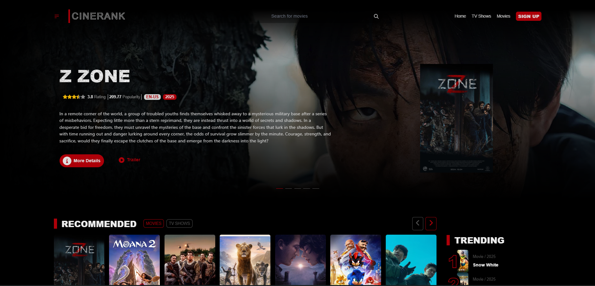
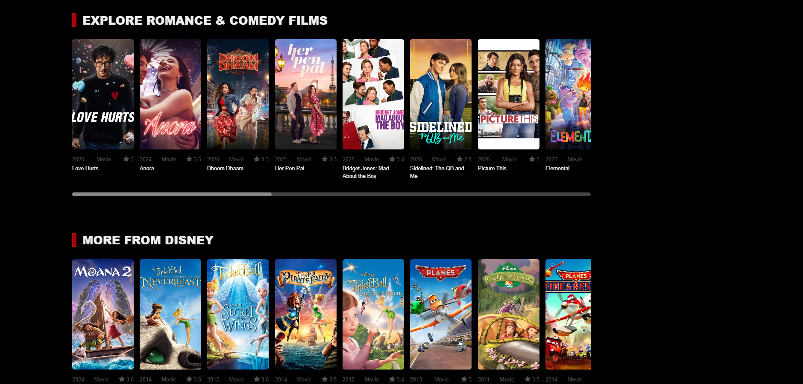
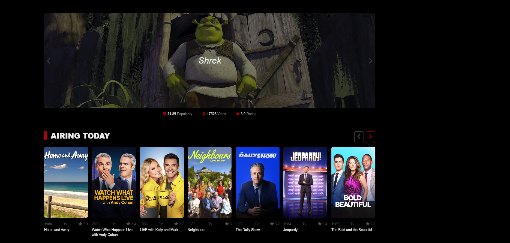
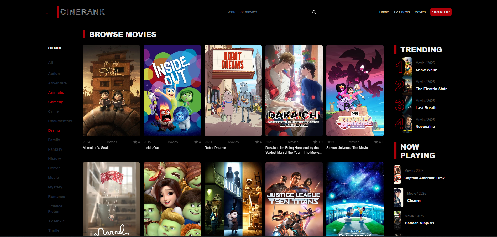
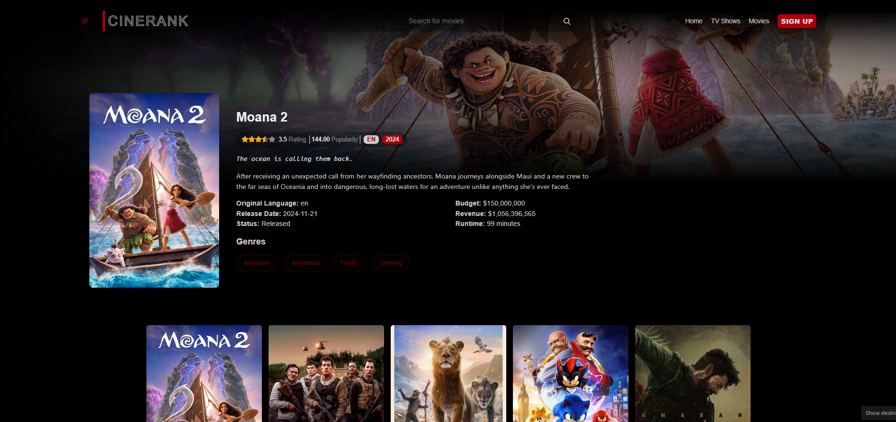

# 🎥 CineRanker

A modern movie discovery application built with **Next.js** using The Movie Database (TMDb) API.

## 📸 Screenshots

Here are some screenshots of CineRanker in action:











## 🎬 Features

- **Movie Discovery:** Search for movies and explore detailed information, such as cast, reviews, and trailers.
- **Dynamic Filtering:** Filter movies by genres, ratings, and more.
- **Responsive Design:** Optimized for all devices, from desktops to smartphones.
- **TMDb Integration:** Uses The Movie Database API for accurate and up-to-date movie data.

## 🚀 Getting Started

Follow the steps below to set up CineRanker on your local machine:

### ⚙️ Prerequisites

- 🖥️ **Node.js** (v16 or higher)
- 📦 **npm** or **yarn**
- 🔑 A TMDb API key ([Sign up for one here](https://www.themoviedb.org/))

### 🛠️ Installation

1. **📂 Clone the Repository:**

   ```bash
   git clone https://github.com/kruizo/cine-ranker-tmdb.git
   cd cine-ranker-tmdb
   ```

2. **📥 Install Dependencies:**

   ```bash
   npm install
   # or
   yarn install
   ```

3. **🔧 Configure Environment Variables:** Create a `.env.local` file in the root of the project and add your TMDb API key:

   ```env
   NEXT_PUBLIC_TMDB_API_KEY=your_api_key_here
   ```

4. **▶️ Run the Development Server:**

   ```bash
   npm run dev
   # or
   yarn dev
   ```

   Open [http://localhost:3000](http://localhost:3000) to view the app in your browser.

## 🖼️ Screenshot
